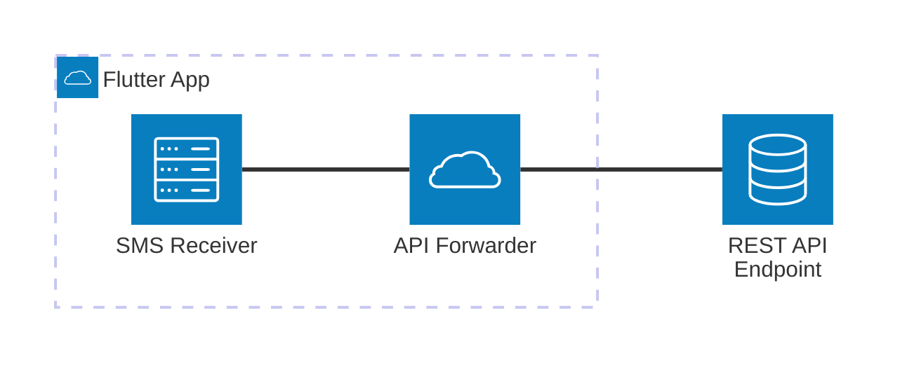

# sms_to_api

[](LICENSE)

Forward SMS messages to a REST API using Flutter.

## Overview

`sms_to_api` is a Flutter application that listens for incoming SMS messages and forwards them to configurable REST API endpoints. Settings are saved through a Flutter↔︎Kotlin method channel and encrypted on-device via Android's `EncryptedSharedPreferences`, falling back to legacy storage only when secure storage is unavailable (e.g., during tests).

## Architecture



**Diagram Explanation:**

- The Flutter app receives SMS messages, processes them, and forwards them to a REST API endpoint.
- The architecture is modular, separating SMS reception and API forwarding logic.

## Features

- Configure multiple REST API endpoints with individual auth headers
- Validate API connectivity (manual validation with feedback)
- Store settings securely using encrypted preferences (falls back to shared preferences when secure storage is unavailable)
- Forward SMS messages to the API
- Start/stop/bind/unbind Android foreground service
- View service status and logs
- Restrict forwarding to an allow-list of senders

## Getting Started

### Prerequisites

- [Flutter SDK](https://docs.flutter.dev/get-started/install)
- Android device or emulator

### Installation

1. Clone the repository:

   ```sh
   git clone <repo-url>
   cd sms-to-api
   ```

2. Install dependencies:

   ```sh
   flutter pub get
   ```

3. Run the app:

   ```sh
   flutter run
   ```

## Development

- Install deps: `flutter pub get`
- Run app: `flutter run -d <device>`
- Analyze: `flutter analyze`
- Test: `flutter test` or `flutter test --coverage`
- Build APK: `flutter build apk --release`
- Build AAB: `flutter build appbundle`
- Format: `dart format lib test` (or `flutter format .`)

## Configuration

Use the home screen shortcuts to configure profiles and sender allow-lists:

- **Profiles** → add one or more API endpoints with friendly names, URLs, keys, and per-endpoint auth headers.
- **Phone Numbers** → optionally limit forwarding to specific numbers or short codes; when empty, all SMS will be forwarded.
- **Validate APIs** from the home screen to ensure at least one active endpoint responds with HTTP 200 prior to enabling the Android service.

## Project Structure

- `lib/main.dart`: App entry point
- `lib/screen/home.dart`: Home screen and main logic
- `lib/screen/api_endpoints.dart`: Manage endpoint profiles
- `lib/screen/logs.dart`: Logs screen for viewing forwarded SMS logs
- `lib/screen/phone_numbers.dart`: Manage allowed sender phone numbers/short codes
- `lib/service/api_service.dart`: API service for sending SMS data
- `lib/service/log_service.dart`: Service for managing and storing logs
- `lib/storage/settings/`: Settings storage and type definitions
- `lib/storage/logs/`: Log storage implementation

## Dependencies

- `flutter`: Flutter SDK
- `cupertino_icons`: iOS-style icons
- `shared_preferences`: legacy/local storage fallback
- `http`: HTTP requests
- `androidx.security:security-crypto`: Android encrypted preferences (native)
- `kotlinx-coroutines-android`: Native service background work (native)
- (and any other dependencies listed in `pubspec.yaml`)

## Coding Style

- Dart/Flutter with 2‑space indentation.
- Prefer `const` widgets and `final` where possible.
- Follow `flutter_lints` (configured in `analysis_options.yaml`).
- Resolve warnings before pushing/PRs. Format with `dart format lib test`.

## Testing

- Framework: `flutter_test` with `WidgetTester`.
- Tests live under `test/` and end with `_test.dart`.
- Core unit tests live in `test/service` and `test/storage`; widget smoke tests stay in `test/widget_test.dart`.
- Run: `flutter test` (fast, deterministic tests preferred).
- Coverage: `flutter test --coverage` (outputs `coverage/lcov.info`).

## Android Notes

- Requires SMS permissions and a foreground service to receive messages reliably.
- Validate on a real device for background delivery and service behavior.
- Service early-stop: when an incoming SMS does not match configured phone numbers (or no endpoints are active), the service stops immediately and does not remain in the foreground.
- Works as a non-default SMS handler by listening for `android.provider.Telephony.SMS_RECEIVED` broadcasts (requires the RECEIVE_SMS runtime permission on modern Android).
- Foreground work runs on structured Kotlin coroutines and the service returns `START_NOT_STICKY` to comply with modern Android background limits. Keep an eye on OEM-specific battery optimizations.

## Security

- Do not commit secrets. Configure API URLs and keys inside the app.
- Settings are stored using encrypted preferences on Android with automatic redaction in logs/snackbars.
- Validate API connectivity using the in‑app validation before release testing.

## Contributing

Please see `CONTRIBUTING.md` for commit conventions, PR expectations, and testing requirements.

## License

This project is licensed under the MIT License. See the [LICENSE](LICENSE) file for details.

You are free to use, copy, modify, merge, publish, distribute, sublicense, and/or sell copies of the software, subject to the terms of the MIT License.
