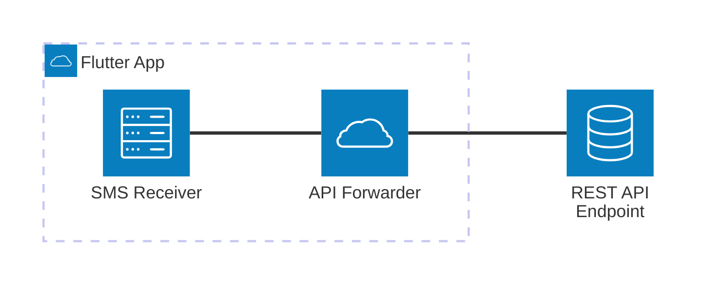

# sms_to_api

[](LICENSE)

Forward SMS messages to a REST API using Flutter.

## Overview

`sms_to_api` is a Flutter application that listens for incoming SMS messages and forwards them to a configurable REST API endpoint. The app allows you to set the API URL and API key in the settings screen, and stores these securely using `shared_preferences`.

## Architecture



**Diagram Explanation:**

- The Flutter app receives SMS messages, processes them, and forwards them to a REST API endpoint.
- The architecture is modular, separating SMS reception and API forwarding logic.

## Features

- Configure REST API endpoint and API key
- Validate API connectivity (manual validation with feedback)
- Store settings securely
- Forward SMS messages to the API
- Start/stop/bind/unbind Android foreground service
- View service status and logs

## Getting Started

### Prerequisites

- [Flutter SDK](https://docs.flutter.dev/get-started/install)
- Android device or emulator

### Installation

1. Clone the repository:

   ```sh
   git clone <repo-url>
   cd sms-to-api
   ```

2. Install dependencies:

   ```sh
   flutter pub get
   ```

3. Run the app:

   ```sh
   flutter run
   ```

## Development

- Install deps: `flutter pub get`
- Run app: `flutter run -d <device>`
- Analyze: `flutter analyze`
- Test: `flutter test` or `flutter test --coverage`
- Build APK: `flutter build apk --release`
- Build AAB: `flutter build appbundle`
- Format: `dart format lib test` (or `flutter format .`)

## Configuration

Go to the **Settings** screen in the app to set your API URL and API key. These are required for the app to forward SMS messages.

## Project Structure

- `lib/main.dart`: App entry point
- `lib/screen/home.dart`: Home screen and main logic
- `lib/screen/settings.dart`: Settings screen for API configuration
- `lib/screen/logs.dart`: Logs screen for viewing forwarded SMS logs
- `lib/screen/phone_numbers.dart`: Manage allowed/blocked phone numbers
- `lib/service/api_service.dart`: API service for sending SMS data
- `lib/service/log_service.dart`: Service for managing and storing logs
- `lib/storage/settings/`: Settings storage and type definitions
- `lib/storage/logs/`: Log storage implementation

## Dependencies

- `flutter`: Flutter SDK
- `cupertino_icons`: iOS-style icons
- `shared_preferences`: Local storage for settings
- `http`: HTTP requests
- (and any other dependencies listed in `pubspec.yaml`)

## Coding Style

- Dart/Flutter with 2‑space indentation.
- Prefer `const` widgets and `final` where possible.
- Follow `flutter_lints` (configured in `analysis_options.yaml`).
- Resolve warnings before pushing/PRs. Format with `dart format lib test`.

## Testing

- Framework: `flutter_test` with `WidgetTester`.
- Tests live under `test/` and end with `_test.dart`.
- Run: `flutter test` (fast, deterministic tests preferred).
- Coverage: `flutter test --coverage` (outputs `coverage/lcov.info`).

## Android Notes

- Requires SMS permissions and a foreground service to receive messages reliably.
- Validate on a real device for background delivery and service behavior.
- Ensure app is exempt from battery optimizations if necessary.

## Security

- Do not commit secrets. Configure API URL and API key in the app Settings.
- Settings are stored via `shared_preferences` on device.
- Validate API connectivity using the in‑app validation before release testing.

## Contributing

Please see `CONTRIBUTING.md` for commit conventions, PR expectations, and testing requirements.

## License

This project is licensed under the MIT License. See the [LICENSE](LICENSE) file for details.

You are free to use, copy, modify, merge, publish, distribute, sublicense, and/or sell copies of the software, subject to the terms of the MIT License.
